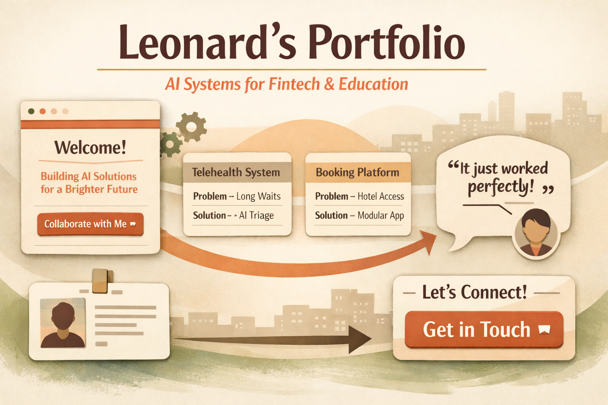

# Portfolio Scroll Wireframe



[](https://github.com/leonardphokane/portfolio-scroll-wireframe)
[](https://leonardphokane.github.io/portfolio-scroll-wireframe/)
[](LICENSE)


## Overview
This project is part of **Week 1: Draw the Path** in the *General AI Fluency* track.  
The goal is to sketch a portfolio sitemap and build a simple scroll‑based wireframe that moves a visitor from landing → proof of work → trust → action.

The wireframe demonstrates:
- A **hero section** with proof statement and initial CTA.
- **Case studies** written as problem → solution → outcome.
- A **testimonial block** for third‑party validation.
- A **contact section** with the boldest visual weight and final CTA.

---

## Why It Matters
Once you know what you’re proving and the action you want, the pages almost choose themselves:
- A place to land (hero).
- The work that proves it (case studies).
- Who you are (embedded About).
- How to act (contact CTA).

This scroll layout ensures every section builds toward conversion without unnecessary exits.

---

## Deliverables
For Week 1, the required artifacts are:
- 📸 Photo of sitemap sketch.
- 🖼️ Screenshot of Claude Project with proof statement in custom instructions.
- 📝 Screenshot of pressure‑test prompt + Claude’s output.
- ✍️ Reflection note: one change made based on feedback.

Reference: [Week 1: Draw the Path](https://aifluency.flyrank.ai/week-01.html#draw-the-path)

---

## Project Structure

---
```bash portfolio-scroll-wireframe/
│
├── index.html   # Main HTML file with embedded CSS
├── script.js    # JavaScript for interactivity (CTA click effects, logging)
└── README.md    # This file 

```

---


<<<<<<< HEAD
=======
---

>>>>>>> 5cede9a39d225461ee58d5365ee72ce21f85a4b9
## How to Run
1. Clone or download this repo.
2. Open `index.html` in your browser (double‑click or use VS Code Live Server).
3. Scroll through the wireframe:
   - Hero → Case Studies → Testimonial → Contact.
   - Buttons animate on click and can be linked to external profiles (e.g., LinkedIn).

---

## Next Steps
- Deploy via GitHub Pages or your personal site.
- Share the live URL on LinkedIn under **Projects**.
- Continue evolving the portfolio alongside the ML Capstone work.

---

## Credits
Built as part of the **General AI Fluency Track**.  
Assignment: *Week 1 — Draw the Path: Portfolio Sitemap + Toolkit*.  
